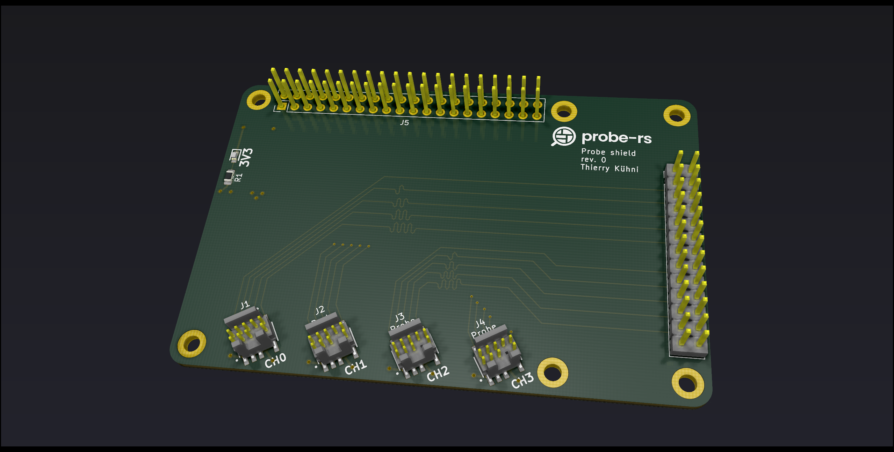
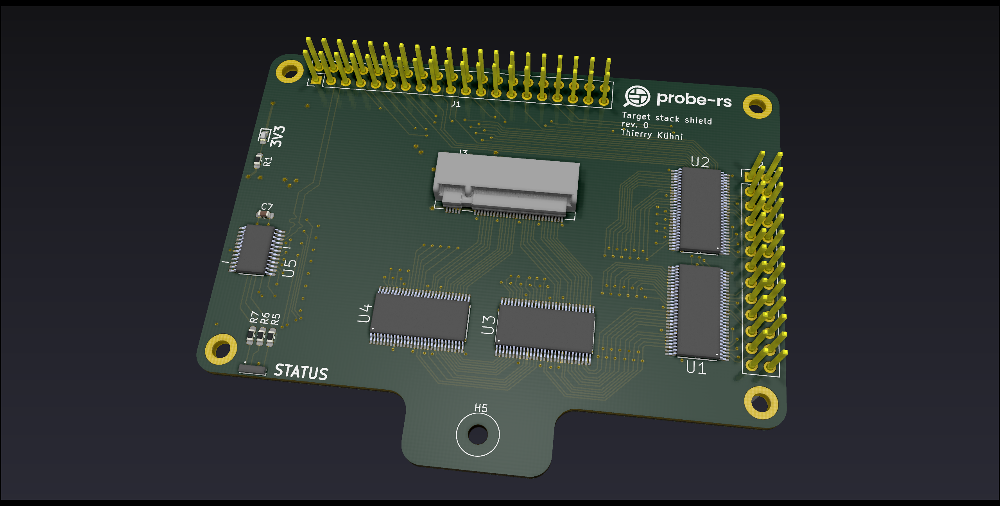
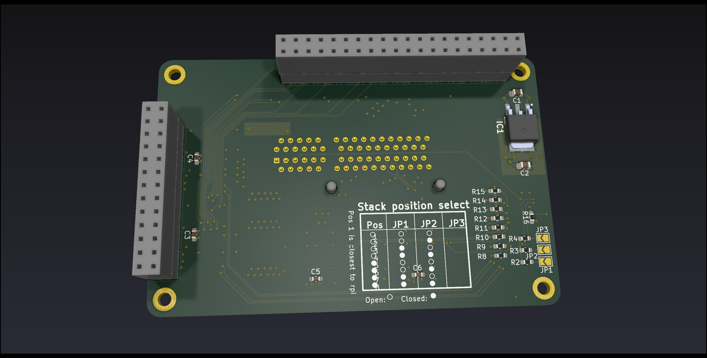

# hive
Compact and modular Raspberry Pi shield for testing probe-rs

## Navigation
| Directory | Contents |
| --- | --- |
| [component_library](./component_library/) | The global hive project component library for KiCad |
| [concept](./concept/) | Concept files of this project as well as testboards, preliminary part lists etc. |
| [renders_3dmodels](./renders_3dmodels/) | 3d models and renders of shields |
| [shields](./shields/) | Shields needed to assemble the testing hardware |

# Overview

##PCB

###### Probe Shield

###### Target Stack Shield

##Assembly
The full assembly consists of 1x Raspberry Pi 4 B, 1x Probe shield and up to 8x Target stack shield. Each target stack shield can hold one daughterboard with 4 targets (not included in the pictures below). Optionally you can mount a 3D printed probe holder case to put the probes in.

