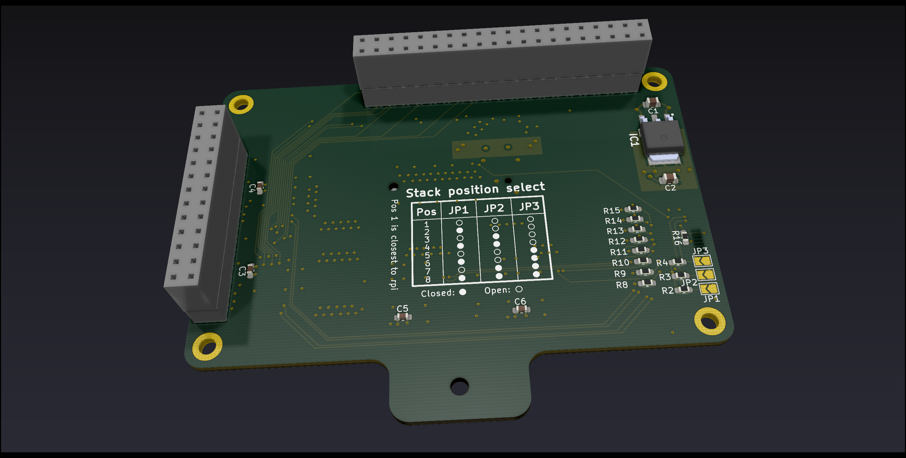

# hive
Compact and modular Raspberry Pi shield for testing probe-rs

## Navigation
| Directory | Contents |
| --- | --- |
| [component_library](./component_library/) | The global hive project component library for KiCad |
| [concept](./concept/) | Concept files of this project as well as testboards, preliminary part lists etc. |
| [renders_3dmodels](./renders_3dmodels/) | 3d models and renders of shields |
| [shields](./shields/) | Shields needed to assemble the testing hardware |

## Overview
### Probe Shield

### Target Stack Shield

